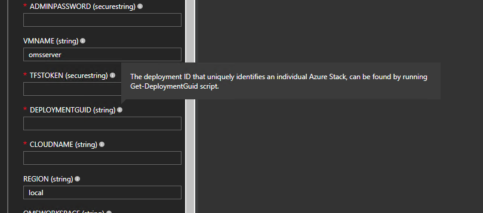

# OMS Workspace

An OMS (Operations Management Suite) workspace is needed as the platform aggregating data from all Azure Stacks. 

To create an OMS workspace:

PRE-REQUISITES
- Running instance of Azure Stack (1709 or higher)
- Subscription to Azure (OMS Log Analytics)
- Internet connection from Azure Stack OMS VM to Azure

Note: Windows Live ID credentials for Azure is not supported by this tool. So please make sure you deploy OMS using an account that is not a windows live ID.  

SETTING UP THE LOG ANALYTICS RESOURCE
1. Log into the Azure Portal (portal.azure.com)
2. Go to Log Analytics via the search box
3. Create a new log analytics resource by clicking the +Add button
4. Provide the appropriate information. 
5. After the deployment succeeds, note down the **resource group**, **Workspace Name**, and **Subscription ID**. They will be needed when deploying the ARM template later. 

# Deploy Data Collection scheduled tasks to a data collection VM 

To see aggregated usage from all of your Azure Stacks, you need to deploy a data collection VM on **each** of your Azure Stacks. 

## Prerequisites
- A running Azure Stack that is [registered](https://docs.microsoft.com/en-us/azure/azure-stack/azure-stack-register) to an Azure subscription that has downloaded **Windows Server 2016 - eval** image from Marketplace. 
- An OMS workspace. 

## Steps to Deploy


To deploy a usage collection VM on an Azure Stack:
1. Connect to the host machine. 
2. Navigate and login to the admin portal for the Azure Stack instance.
3. Create a new storage account, remember its name, you will need it for the ARM template later. 
4. Within the new storage account, create a new blob container with access type **Blob**. Remember the name, you will need it for the ARM template later. 
5. Upload [MasterScript.ps1](../MasterScript.ps1) into the new blob container. 
6. In the left pane, Click **New (+ sign)** -> **Custom** -> **Template deployment**. 
7. In **Template**, paste the content of **azuredeploy.json** which can be found [here](../template/azuredeploy.json) into the text box before clicking **Save**. 
8. Fill in the parameters according to instructions that appear in the tooltips. 



Note that some fields may be pre-populated to a default value, always double-check the pre-populated value descriptions to make sure it is applicable to your deployment. To obtain the deployment guid for an ASDK, open PowerShell on the host machine, and run [Get-DeploymentGuid.ps1](../Get-DeploymentGuid.ps1).
    Note to get the DeploymentID (GUID) on multi-node Azure Stack deployments, you must connect to the Privileged Endpoint using a PS-Session and execute the Get-AzureStackStampInformation function. Copy the value in the first parameter returned which is DeploymentID.

9. Use the Default Provider Subscription, create a *new* resource group, and pick a location before hitting **Create**. 
10. The deployment takes around 30 minutes on average. 

This ARM template deploys a VM and runs a PowerShell script using a custom script extension. 


The scripts sets up 2 scheduled tasks: 
1. Upload of 1-day worth of usage data provided from the Provider Usage API at 9am every day.
2. Upload of operational data every 13 minutes.

The data are uploaded to the OMS workspace you specified in the ARM template. 

Note: For usage data, the script is setup to query and upload usage data reported from the day before yesterday each time the scheduled task runs. Note that no usage data will be uploaded if there are no tenant usage during the timeframe specified. 

## Troubleshooting
1. To verify that data is getting uploaded to OMS environment:

    Log in to your OMS workspace (after 1 day for usage data and 15 minutes for operational data) and click on **all collected data** in log search. If you can see operational and usage data there, the pipeline is working.  

3. What happens if I cannot find any data in OMS? 

    There are a couple places things could have gone wrong. 
    -  The scheduled task(s) did not get set up. To check, rdp into the machine you deployed using the ARM template and launch **Task Scheduler** from Windows Start menu to check if there is a scheduled task called **UsageDataUpload**. If there isn't, it may help to check the logs for the custom script extension following question 1 step 3 and look for any errors with registering a scheduled task.
    - Unable to access the usage API. To check for this, look in `C:\AZSAdminOMSInt\UsageSummary.json` on the deployed VM, if there are no records here, that means `usagesummaryjson.ps1` failed at one point. 
    - There are no usage data collected. On the deployed VM, if `C:\AZSAdminOMSInt\UsageSummary.json` shows an empty array, that most likely means there were no usage data available in the time frame specified (the day before yesterday).
    - If there are usage entries in `C:\AZSAdminOMSInt\UsageSummary.json` and the sceduled task exists, then the error likely occurred in `C:\AZSAdminOMSInt\uploadToOMS.ps1`, which uploads usage data to OMS from the json file.

# OMS Solution

## IMPORTING THE OMS DASHBOARD  
1. Navigate to the newly created log analytics resource. From the OMS workspace overview page via the Log analytics overview in the azure portal, click on OMS portal.
2. Select view designer
3. Click Import and select a view from the Solution Tiles folder.

Note: Errors may appear since data has not been inputted. Once imported, say save and go back to the main dashboard. 

4. Repeat step 2-3 for the remaining views within the Solution Tiles folder.

## CHECKING THE UPDATED OMS DASHBOARD
1. To access the OMS dashboard, go back to the resource in the log analytics section, and click on OMS workspace.
2. From there, click OMS portal, which should open a new tab and display the views currently uploaded to OMS.
 
# Power BI

## Prerequisites
1. PowerBI Desktop. To download, see here: https://powerbi.microsoft.com/en-us/downloads/
2. Usage data already piped up to your OMS workspace. 
 
## Installation Steps

1. Download the `usage_dashboard_template.pbit` file (PowerBI template) from [here](../PowerBI).
2. Open the file with Power BI desktop. PowerBI will complain that it cannot connect to the data sources specified. Next we adapt the existing queries to connect to the data sources we need. 
3. In the **Home** ribbon under **External Data**, click **Edit Queries**. 
4. Ensure Usage is selected in the left pane. 
5. In the **View** ribbon, open **Advanced Editor**. 
6. For the line 
```
let Source = Json.Document(Web.Contents("..."))
```
You would want to modify the link such that it is referencing your OMS workspace in azure. To get the correct link, in the OMS workspace you created that has Azure Stack usage and operational data, go into log analytics and click **Analytics** tile in the top ribbon. In the new page, open a new tab by clicking **+** next to "Home Page" and enter the following query:
```
Usage_CL
| where Type_s == "Usage"
| project AdditionalInfo_s, DeploymentGuid_g , EndTime_t , Location_s , MeterID_g , MeterName_s , Quantity_d , ResourceName_s , ResourceType  , ResourceURI_s , StartTime_t , SubscriptionId , Tenant_s 
```
and then select a time range in the top right corner. After that, click **Export** in the upper right corner, then click **Power BI Query (M)** to download a text file containing the a query for your workspace. 


7. Replace the content in the Advanced editor with the content of the file that you downloaded in the last step.  Click **Done**. 

8. Click **Edit Credentials** in the banner that pops up and and navigate to the **Organizational account** tab to sign in using your Azure Credentials in the account that contains your OMS workspace. Click **Save**.

9. Similarly, you can make capacity data available in PowerBI fetching it from OMS by repeating step 4 - 8, with a different query: 
```
AzureStack_CL
| where Type_s == "Capacity"
| project DeploymentGuid_g , TimeGenerated, DiskAvail_d , DiskUsed_d , MemoryAvail_d , MemoryUsed_d , IPPoolAvail_d , IPPoolUsed_d 
```

9. There are two excel files containing supplementary information. You can find them [here](../data_sources). Download them to your machine.

10. In Power BI, in the **Home** ribbon, click on **Data Source Settings**. In the popup that follows, click on **Change source...** for each of the two excel files and change the source to point to the two excel files that you downloaded in the previous step. 

11. Click **Close & Apply** in the Home ribbon. 

For specific documentation on the Power BI dashboard template, refer to the [dashboard documentation](./dashboard.md). 

## Limitations

1. As of 8/9/2017, there is 8mb size limit on the request that PowerBI uses to fetch data from OMS. This restriction is planned to be lifted in the future by the OMS Log Analytics team, Yammer thread is linked here: https://www.yammer.com/azureadvisors/threads/924427094 (In OMS Log Analytics Upgrade Private Preview group in Azure Advisors network).
2. If the restriction persists, one way to increase the number of days of usage data available (by 24x) is pull in daily aggregated usage data from OMS instead of hourly aggregated data. The obvious drawback for this method is that one will not be able to  drilldown to the hourly level on the PowerBI dashboard. 
